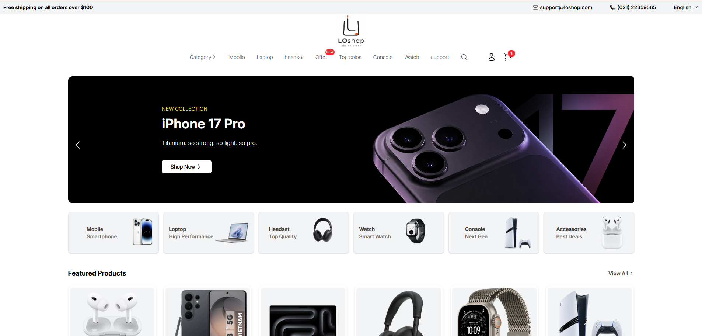

# LOshop

LOshop is a responsive e-commerce website for displaying and selling
digital products such as laptops, headphones, smart watches and consoles.

## Preview

## Technologies

- HTML5
- CSS3
- Tailwind CSS
- Git & GitHub

## Features

- Responsive design
- Product cards
- Navigation menu
- Product categories
- Shopping cart UI
- Modern and clean interface

## Installation

1. Clone the repository
2. Open the project folder
3. Run the project using Live Server

## Status

🚧 This project is currently under development.